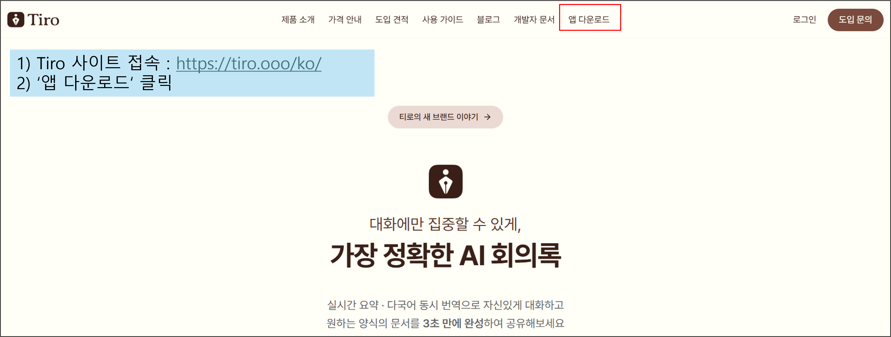
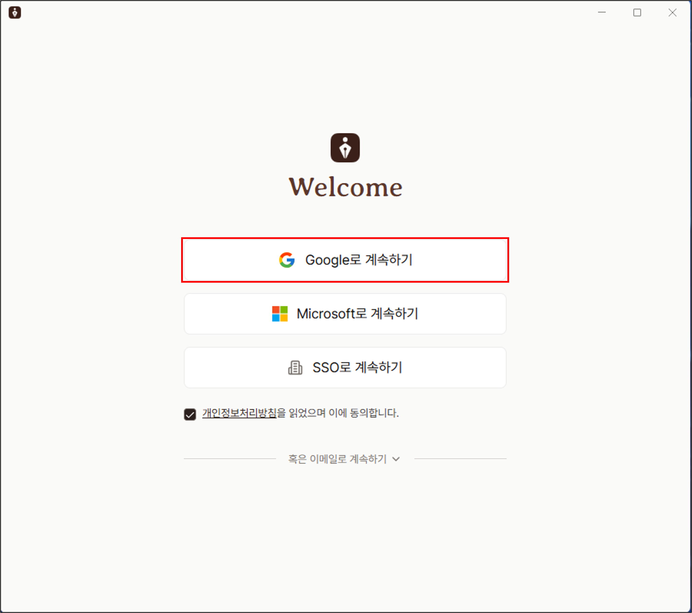
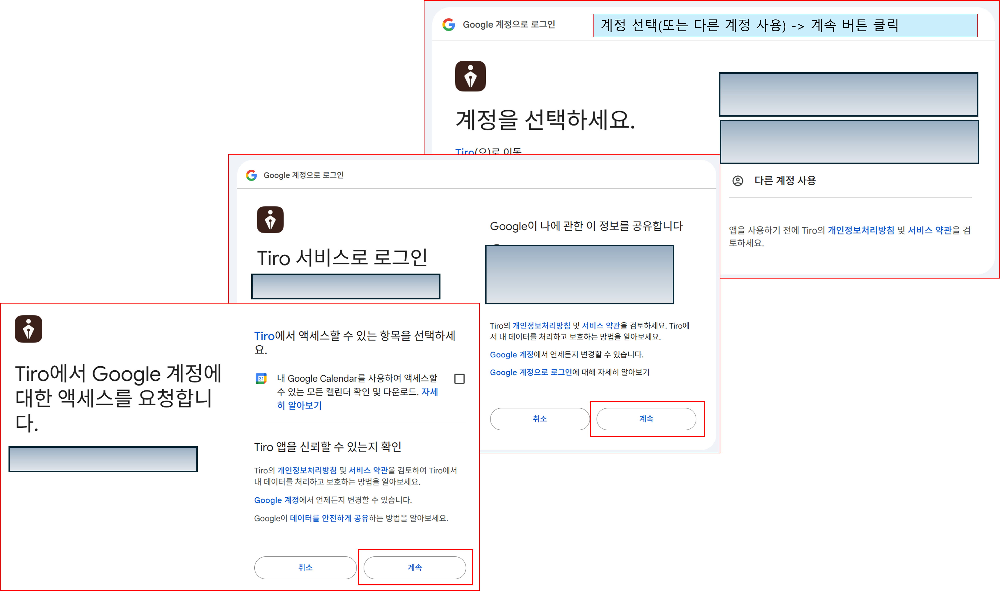
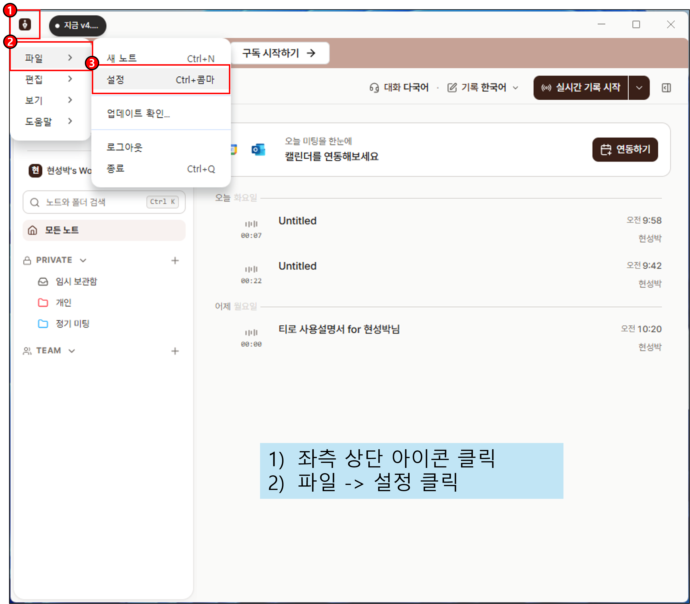
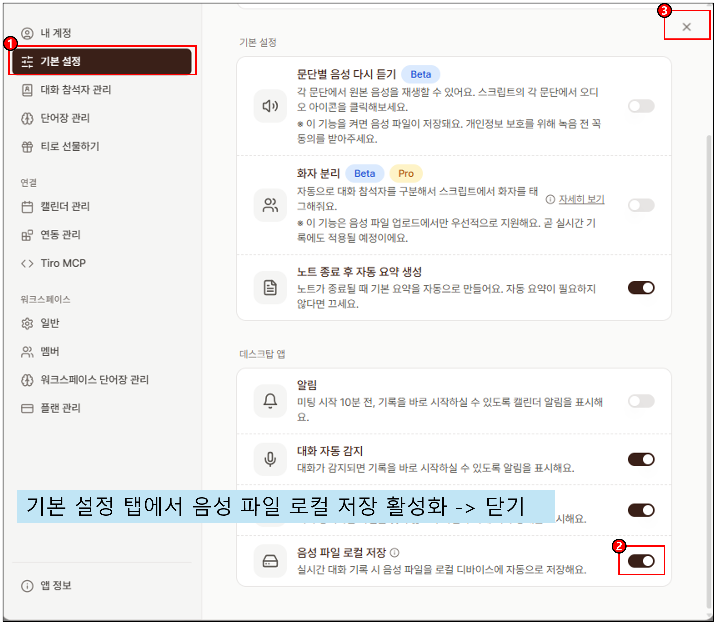
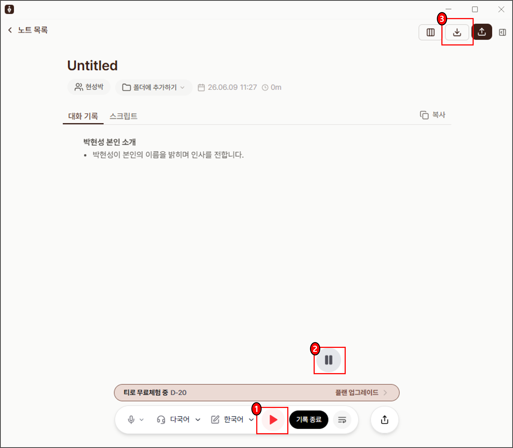

# ice breaking: Ai-Friendly 리더십

본 세션은 Ai-Friendly 리더십 교육 과정의 아이스 브레이킹을 위한 공간입니다. 
상세 학습 내용과 활동 양식은 향후 제공될 예정입니다.

## 실습 가이드

이번 시간에는 "AI 시대, 리더의 고민과 역할"에 대해 회의를 해보는 시간입니다. 회의의 진행할 때 녹음을 해주세요. 녹음은 Tiro를 이용할 것이며 이에 대한 내용은 아래 이미지를 참고하시기 바랍니다.

아래 이미지 가이드를 참고하여 진행해 주시기 바랍니다.

### 1. 앱 다운로드

### 2. 가입 단계

### 3. 가입 상세

### 4. 사전 설정 1

### 5. 사전 설정 2

### 6. 파일 저장

